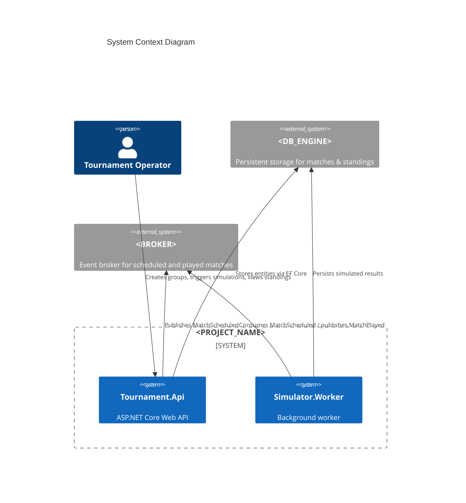
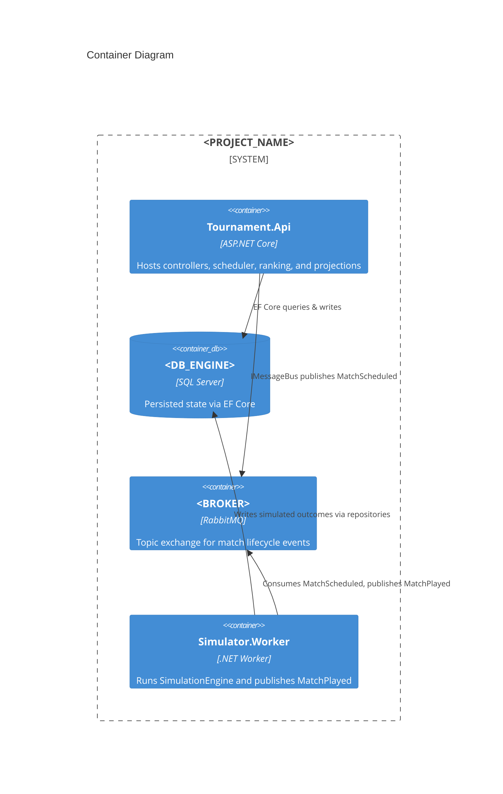

# File: docs/Architecture.md

<PROJECT_NAME>=GroupStageSim · <DB_ENGINE>=SQL Server · <BROKER>=RabbitMQ · <NAMESPACE>=groupsim · <API_PORT>=5180 · <DB_PORT>=1433 · <RABBITMQ_PORT>=5672 · <BASE_RATE>=1.3 · <HOME_ADV>=1.05 · <AWAY_MOD>=0.95 · <DEFAULT_SEED>=42

## System Context

## Container Overview

## Narrative
- `Tournament.Api` owns scheduling, ranking, and API projections. It stores canonical data in `<DB_ENGINE>` and emits `MatchScheduled` events to `<BROKER>`.
- `Simulator.Worker` subscribes to the match queue, uses the Poisson-based `SimulationEngine` to produce scores, and publishes `MatchPlayed`. It updates persistence through shared repositories or via Replay endpoint.
- `<BROKER>` decouples the API from simulation throughput, enabling asynchronous scaling and replay.

## Event-Driven Rationale
- API requests remain fast by delegating computationally heavy simulations to the worker.
- Events provide natural audit trails and enable additional subscribers (e.g., analytics) without changes to the API.

## Microservice Boundaries & Scaling
- API scales horizontally for read-heavy workloads; worker scales according to simulation concurrency needs by increasing consumer count.
- RabbitMQ exchange supports routing multiple worker pools if Monte Carlo load increases.

## Alternatives Considered
- **In-process simulation**: simpler deployment but couples heavy compute to request pipeline, hurting latency and scaling options.
- **Direct DB polling**: avoided to prevent thundering herd and to embrace explicit event choreography.

## Risks & Mitigations
| Risk | Mitigation |
| --- | --- |
| Eventual consistency between scheduled events and standings | Use idempotent handlers, store event metadata, expose status fields on matches. |
| Duplicate deliveries (at-least-once) | Consumers check `CorrelationId` + match identity before reapplying results. |
| RabbitMQ downtime | Implement retry-with-exponential-backoff and DLQ re-drive procedures. |
| EF Core contention under high simulation volume | Use batched updates, concurrency tokens, and configure worker throttling. |

## Why This Matters
- Provides a crisp narrative for interviews showing deliberate architecture choices and trade-offs.
- Diagrams help stakeholders visualize responsibilities and scaling levers quickly.
- Documented risks demonstrate senior-level thinking about resilience and operational pragmatism.
