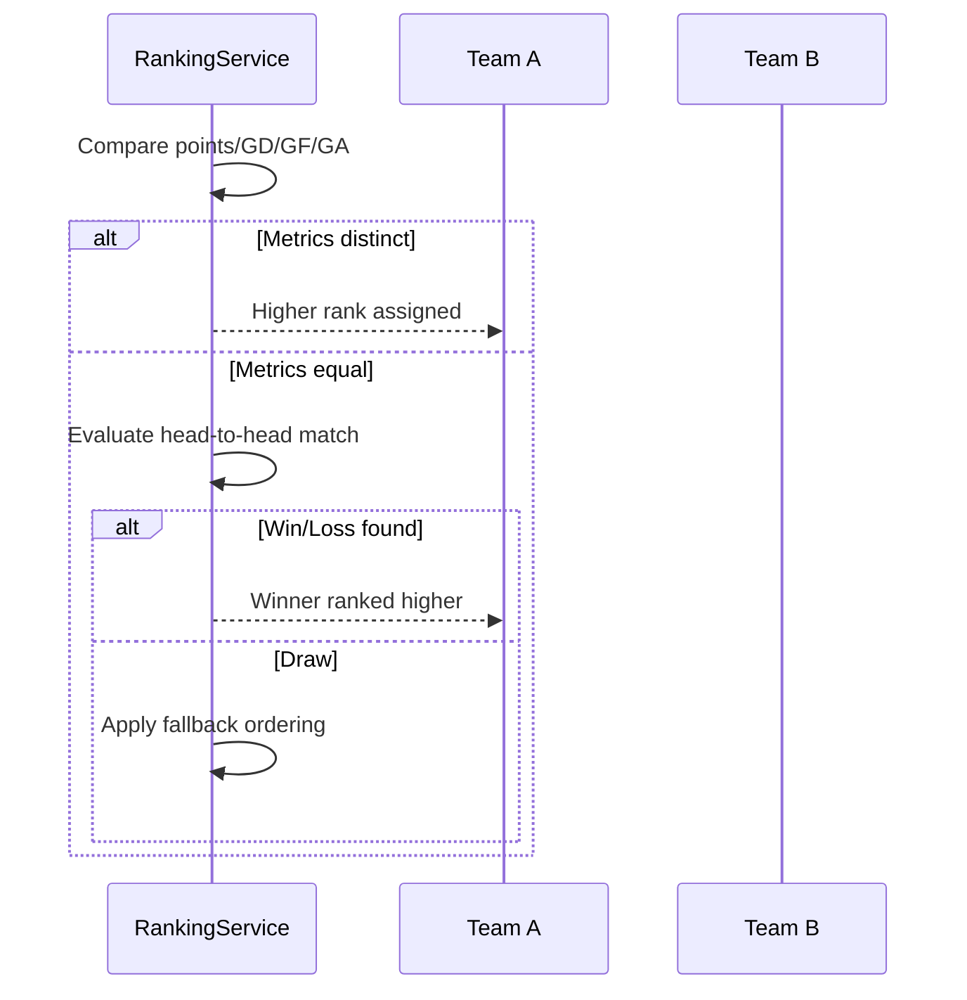

# File: docs/RankingRules.md

<PROJECT_NAME>=GroupStageSim · <DB_ENGINE>=SQL Server · <BROKER>=RabbitMQ · <NAMESPACE>=groupsim · <API_PORT>=5180 · <DB_PORT>=1433 · <RABBITMQ_PORT>=5672 · <BASE_RATE>=1.3 · <HOME_ADV>=1.05 · <AWAY_MOD>=0.95 · <DEFAULT_SEED>=42

## Points & Primary Metrics
- Win = 3 points, Draw = 1, Loss = 0.
- Goal Difference (GD) = Goals For − Goals Against.
- Goals For (GF) sorted descending, Goals Against (GA) ascended.

## Tie-Break Sequence
1. Points (descending).
2. Goal Difference (descending).
3. Goals For (descending).
4. Goals Against (ascending).
5. Head-to-Head mini-table among tied teams.
6. If still tied, use deterministic fallback (e.g., team name alphabetical) logged for transparency.

## Two-Team Tie Flow

## Three-Team Mini-Table
1. Extract matches where both teams belong to the tied subset.
2. Recompute points, GD, GF, GA using only those results.
3. Reapply the primary ordering sequence.
4. If one team emerges uniquely, remove it and continue comparing remaining teams; otherwise apply fallback.

### Example
| Match | Score |
| --- | --- |
| Alpha vs Bravo | 1-0 |
| Bravo vs Charlie | 2-1 |
| Charlie vs Alpha | 3-2 |
- Mini-table points: Alpha 3, Bravo 3, Charlie 3.
- Mini-table GD: Alpha 0, Bravo 0, Charlie 0.
- Mini-table GF: Charlie 4, Bravo 2, Alpha 3 → Charlie ranks highest, others compared again using remaining metrics.

## Worked Scenario
- Teams Alpha, Bravo, Charlie finish with 7 points; Delta has 0.
- Apply mini-table to break top three tie; outcome aligns with goals scored within subset.
- After ranking Alpha > Charlie > Bravo within subset, recombine with Delta as fourth.

## Test Ideas
- Refer to [Testing Strategy](./Testing.md) for domain-specific unit and integration cases, including edge scenarios like triple draws.

## Why This Matters
- Transparent tie-break flow shows mastery of FIFA-like tournament logic in interviews.
- Deterministic algorithm ensures repeatable standings across simulations, essential for automated grading.
- Mini-table documentation prevents divergent interpretations when implementing tests or front-end features.
