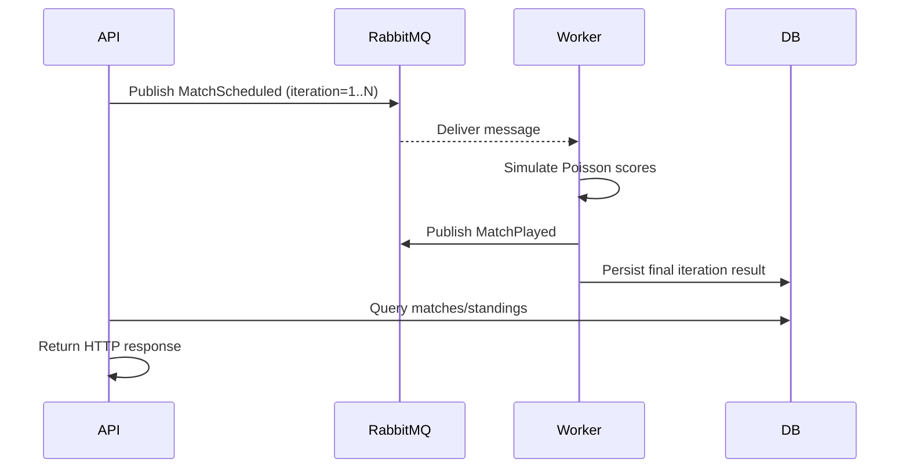

## Volledige Deep Dive – GroupStageSim

> Doel: Een uiterst gedetailleerde uitleg van alle keuzes, patronen, concepten en interne werking. Gericht op een ontwikkelaar die elk "waarom" wil begrijpen – van interface selectie tot simulatie wiskunde, RabbitMQ AMQP flow, EF Core gedrag, dependency injection lifecycle en teststrategieën.

### Inhoudsopgave
1. Overzicht & Doelstellingen
2. Fundamenten van Clean Architecture in deze codebase
3. Waarom Interfaces (en geen abstract classes) – Diepgaande Motivatie
4. Dependency Injection & .NET Generic Host – Interne Mechaniek
5. Service Lifetimes: Scoped vs Singleton vs Transient in deze oplossing
6. RabbitMQ & AMQP: Protocol, Exchanges, Queues, QoS, Acknowledgements
7. Berichtstromen in GroupStageSim – Sequence Diagrams
8. Idempotentie & Betrouwbaarheid: Retry, Backoff, Acks, Nacks, Redelivery
9. Poisson Simulatie – Wiskunde, Afleiding, Parameterkeuze, Verifiëren
10. Deterministische Random Seeds – HashCode Strategie & Collisies
11. RankingService – Volledige Stap-voor-Stap Berekening met Voorbeeldset
12. Head-to-Head Resolutie – Mini Tabel Constructie
13. EF Core Deep Dive – Change Tracking, Query Splitting Warning Analyse
14. Mapping Strategie (Domain ↔ Persistence) & Invariant Bewaking
15. Context Lifetime & Concurrency Overwegingen
16. Performance Hotspots & Schaling Scenario's (RabbitMQ, DB, CPU simulatie)
17. Test Strategie – Unit, Integration, End-to-End, Property-Based, Load
18. Determinisme Verifiëren – Praktische Checks & Foutscenario's
19. Extensibiliteitspad – Nieuwe Engines, Andere Brokers, Event Sourcing
20. Beveiliging & Configuratie – Secrets, Validatie, Fail-Fast
21. Observability – Logging Structuur, Correlatie, Metrics Uitbreidingen
22. Veelgemaakte Beginnersvragen – Q&A Vorm
23. Resource Overzicht & Verdere Studie
24. Kernsamenvatting

---

### 1. Overzicht & Doelstellingen
GroupStageSim modelleert een klassieke groepsfase (4 teams) en voert probabilistische simulaties uit om resultaten te genereren. De applicatie is ontworpen om:
- Reproduceerbaar te zijn (deterministische simulaties)
- Extensibel te zijn (andere scoring modellen, alternatieve message brokers)
- Testbaar te blijven (heldere schema's, laag-gedefinieerde interfaces)
- Observabel te zijn (logging met correllatie IDs, health endpoints)

### 2. Fundamenten van Clean Architecture in deze codebase
Belangrijkste ideeën:
- Afhankelijkheden wijzen naar binnen: UI → Application → Domain (niet andersom).
- **Domain**: Pure business concepten, geen infrastructuur.
- **Application**: Orkestreert use cases; kent interfaces; bevat Ranking logica.
- **Infrastructure**: Implementaties (RabbitMQ, EF Core repository).
- **Worker**: Achtergrondproces voor simulatie.

Waarom? Minimaliseert impact van infrastructuurwijzigingen op kernlogica. Je kunt RabbitMQ vervangen door Azure Service Bus door enkel één implementatie te veranderen.

### 3. Waarom Interfaces (en geen abstract classes) – Diepgaande Motivatie
We gebruiken interfaces voor `IGroupRepository`, `IMessageBus`, `ISimulationEngine`.

Redenen:
- **Multiple inheritance behoefte**: Klassen kunnen meerdere interfaces implementeren (C# staat geen meervoudige inheritance van classes toe).
- **Contract minimality**: Interfaces kunnen scherp gesneden worden (ISP) – alleen noodzakelijke members.
- **Mockbaarheid**: Testing frameworks (Moq) werken frictieloos met interfaces.
- **Geen default state**: Abstract class brengt vaak impliciete data mee; hier ongewenst.
- **Versionering**: Toevoegen van members -> brekende change; maar we kunnen nieuwe interface maken (`ISimulationEngineV2`) zonder de oude te breken.

Een abstracte basisklasse zou nuttig zijn bij gedeeld gedrag + velden (template method pattern). Hier is dat niet nodig; gedrag is per implementatie uniek (RabbitMqMessageBus vs in-memory bus) én we vermijden onnodige hiërarchie.

### 4. Dependency Injection & .NET Generic Host – Interne Mechaniek
Het .NET Generic Host verwerkt startup als volgt:
1. Bouwt `IHostBuilder` / `WebApplicationBuilder`.
2. Voegt configuratieproviders (JSON, environment) toe.
3. Bouwt `IServiceCollection` met registraties (`AddApplicationServices()`).
4. Construeert een `ServiceProvider` (root).
5. Activeert middleware pipeline (voor API) of background services (Worker) via constructor injection.

DI Resolutie:
- Constructor args worden geëvalueerd.
- Voor ieder vereist type zoekt DI naar registration.
- Levensduur wordt gerespecteerd (Singleton hergebruikt, Scoped per request, Transient nieuwe instantie).

### 5. Service Lifetimes: Scoped vs Singleton vs Transient in deze oplossing
| Type | Voorbeeld | Reden |
|------|-----------|-------|
| Singleton | `Scheduler`, `RankingService` | Stateless, herbruikbaar |
| Scoped | `GroupService`, `DbContext` | Per web request isolatie (transacties / unit-of-work) |
| Transient | (kan gebruikt worden voor mappers) | Lichtgewicht, geen state, hoge frequentie mogelijk |

Waarom geen Singleton DbContext? EF Core DbContext is niet thread-safe; scoped voorkomt race conditions en vervuilde change tracker.

### 6. RabbitMQ & AMQP: Protocol, Exchanges, Queues, QoS, Acknowledgements
**AMQP Kernconcepten:**
- **Exchange**: Routert messages naar queues o.b.v. binding keys.
- **Queue**: FIFO buffer; consumer leest hieruit.
- **Binding**: Relatie exchange ↔ queue + pattern (routing key).
- **Routing Key**: String (bij topic: dot-gescheiden) die exchange gebruikt voor pattern matching.
- **Channel**: Logische verbinding (multiplex) binnen een TCP connection.
- **Ack/Nack**: Consumer bevestigt verwerking (Manual ack in worker).
- **QoS (prefetch)**: `BasicQos(0, 1, false)` – max 1 unacked message tegelijk per consumer.

In onze Worker:
- Channel zet `BasicQos` om backpressure te implementeren.
- Consumer (`AsyncEventingBasicConsumer`) ontvangt events.
- Bij success: `channel.BasicAck(deliveryTag, false)`.
- Bij definitieve failure: `channel.BasicNack(..., requeue:false)`.

### 7. Berichtstromen in GroupStageSim – Sequence Diagrams

### 8. Idempotentie & Betrouwbaarheid: Retry, Backoff, Acks, Nacks, Redelivery
Strategie:
- Max 3 pogingen (`MaxRetryAttempts`).
- Exponentiële backoff `Math.Pow(2, attempts)`.
- Geen requeue na overschrijding / redelivery – voorkomt infinite poison loop.
- Idempotentie door unieke `(MatchId, Iteration)` pair; laatste iteration triggert persist.
- Potentiële uitbreiding: Dead Letter Queue voor mislukte berichten.

### 9. Poisson Simulatie – Wiskunde, Afleiding, Parameterkeuze, Verifiëren
Scoremodellering:
- Aantal goals per team ≈ Poisson(λ)
- λ berekend: `BaseRate * StrengthRatio * HomeAdvantage` (thuis) / `AwayModifier` (uit)
- Strength ratio clamped tussen 0.5 en 1.5 – voorkomt extreme waarden (numerieke stabiliteit + realisme).

Afleiding kort:
- Doelpunten zijn zeldzaam, onafhankelijk → Poisson geschikt.
- Empirisch (voetbal): gemiddelde goals per team per wedstrijd ~1.2 - 1.6.
- `BaseRate` afgestemd op dat interval.

Validatie Ideeën:
- Run 10k simulaties → gemiddelde score ≈ λ.
- Histogram vergelijken met theoretische Poisson PMF.

### 10. Deterministische Random Seeds – HashCode Strategie & Collisies
Seed: `HashCode.Combine(DefaultSeed, match.Id, iteration)`.
- Combine reduceert risico op collisions door mixing.
- `& int.MaxValue` garandeert positief.
- Collisiekans praktisch verwaarloosbaar gezien 128-bit GUID + iteration.

### 11. RankingService – Volledige Stap-voor-Stap Berekening met Voorbeeldset
Voorbeeld wedstrijden (Home-Score–Away-Score):
1. A–B: 2–1 → A win
2. C–D: 1–1 → Draw
3. A–C: 0–2 → C win
4. B–D: 3–0 → B win
5. A–D: 1–1 → Draw
6. B–C: 0–2 → C win

Aggregates na verwerking:
- A: W=1 D=2 L=1 GF=3 GA=5 Pts=5
- B: W=1 D=0 L=2 GF=4 GA=4 Pts=3
- C: W=3 D=1 L=0 GF=6 GA=1 Pts=10
- D: W=0 D=2 L=2 GF=2 GA=6 Pts=2

Sortering: Points → GD → GF → GA → (Head-to-Head indien nodig).

### 12. Head-to-Head Resolutie – Mini Tabel Constructie
Als twee teams exact gelijk staan in alle primaire metrics:
1. Filter wedstrijden waar beide betrokken zijn.
2. Re-bereken mini aggregates.
3. Pas dezelfde sorteerregels toe.
Fallback op alfabetische naam voor determinisme.

### 13. EF Core Deep Dive – Change Tracking, Query Splitting Warning Analyse
Warn melding gezien:
- EF laadt meerdere collection navigations in één query; kan leiden tot cartesiaanse explosies.
Oplossingen:
- Explicit `.AsSplitQuery()` om performance te verbeteren.
- Of opsplitsen in meerdere, gerichte queries.

Change Tracking:
- DbContext houdt entity states bij (Added/Modified/Unchanged/Deleted).
- Beter voor aggregaatmutaties binnen één request; niet delen over threads.

### 14. Mapping Strategie (Domain ↔ Persistence) & Invariant Bewaking
Redenen voor aparte persistence modellen (`GroupData`, `MatchData`):
- Domain invariants (bv. exact 4 teams) enforced bij creatie.
- Persistence model kan extra kolommen toevoegen (audit, timestamps) zonder domain te vervuilen.

### 15. Context Lifetime & Concurrency Overwegingen
`Scoped` DbContext per request voorkomt race conditions.
Potentiële concurrency uitdagingen:
- Simultane simulatie writes → gebruik van optimistic concurrency tokens (uitbreiding).
- Bulk updates → transactie boundary expliciet maken.

### 16. Performance Hotspots & Schaling Scenario's (RabbitMQ, DB, CPU simulatie)
Hotspots:
- Simulatie loops bij hoge iteration counts.
- Ranking berekening bij extreem veel groepen.
- Database I/O (match + standings queries).

Schaling:
- Meerdere Workers (consumer concurrency); verhoog QoS; load-balancing.
- Caching standings (in-memory / Redis) bij veel reads.
- Batch persist van resultaten i.p.v. per match.

### 17. Test Strategie – Unit, Integration, End-to-End, Property-Based, Load
Uitbreidingen:
- **Property-based**: Verzeker dat Points = Wins*3 + Draws*1 altijd (FsCheck).
- **Load**: 10k simulaties performance baseline.
- **Chaos**: Inject random RabbitMQ failures, verwacht resiliente afhandeling.

### 18. Determinisme Verifiëren – Praktische Checks & Foutscenario's
Testcases:
- Herhaal simulatie voor dezelfde `(MatchId, iteration)` → exact gelijke score.
- Andere iteration → nieuwe seed → variatie.
Edge cases:
- Strength ratio extreme → clamp correct.
- Iteration <= 0 → normalisatie naar 1.

### 19. Extensibiliteitspad – Nieuwe Engines, Andere Brokers, Event Sourcing
Simulatie Engines:
- Voeg `ISimulationEngine` implementatie toe (Elo-based updates).
Brokers:
- Implementatie `IMessageBus` voor Azure Service Bus of Kafka.
Event Sourcing:
- Vervang directe persist door append-only event store + projector.

### 20. Beveiliging & Configuratie – Secrets, Validatie, Fail-Fast
Patterns:
- Geen secrets in `appsettings.*`. Alles via `.env`.
- Validatie in `Program.cs` (throw InvalidOperationException bij ontbrekende host/port/user/pass).
- Minimale attack surface door niet onnodig endpoints te exposen.

### 21. Observability – Logging Structuur, Correlatie, Metrics Uitbreidingen
Logging:
- Structured met CorrelationId.
Metrics uitbreiden (Prometheus):
- `simulation_duration_seconds`
- `messages_consumed_total`
- `standing_calculation_ms`

### 22. Veelgemaakte Beginnersvragen – Q&A Vorm
**Q: Waarom geen static helpers?**
A: Static belemmert testbaarheid en vervanging (DIP).
**Q: Waarom niet direct EF Core in controllers?**
A: Scheiding van concerns; testbare use cases; vermijdt ‘fat controllers’.
**Q: Waarom Poisson i.p.v. Uniform random?**
A: Realisme: voetbal scores cluster rond lage integers; uniform zou te veel hoge outliers geven.
**Q: Waarom manual acks in RabbitMQ?**
A: Controle over retry en failure (geen stille drop). 
**Q: Waarom correlation IDs?**
A: Traceer keten van events en API calls – eenvoudiger debugging.

### 23. Resource Overzicht & Verdere Studie
- AMQP Spec: https://www.rabbitmq.com/amqp-0-9-1-reference.html
- EF Core Performance: https://learn.microsoft.com/ef/core/performance/
- OpenTelemetry .NET: https://opentelemetry.io/docs/instrumentation/net/
- FsCheck (Property-based Testing): https://fscheck.github.io/FsCheck/
- Kafka Fundamentals: https://kafka.apache.org/documentation/
- DDD Reference: https://www.domainlanguage.com/ddd/
- Resilience Patterns: https://learn.microsoft.com/azure/architecture/patterns/

### 24. Kernsamenvatting
Dit deep-dive document heeft de onderliggende rationele keuzes blootgelegd:
- Interfaces voor maximale flexibiliteit en testbaarheid.
- DI lifetimes afgestemd op thread-safety en statelessness.
- AMQP flow exact gecontroleerd via manual ack + QoS.
- Poisson distributie voor realistisch score patroon + deterministische seeding.
- Ranking tie-breakers reproduceerbaar en uitbreidbaar.
- EF Core gebruik minimalistisch en bewust van performance en tracking.
- Uitbreidbaarheid voorzien voor simulatiemodellen, messaging en storage strategieën.
- Observability en security als first-class concern via structured logs en fail-fast config.

> Resultaat: Je begrijpt niet alleen wat de code doet, maar ook waarom elke keuze gemaakt is en hoe je deze veilig kunt uitbreiden.
