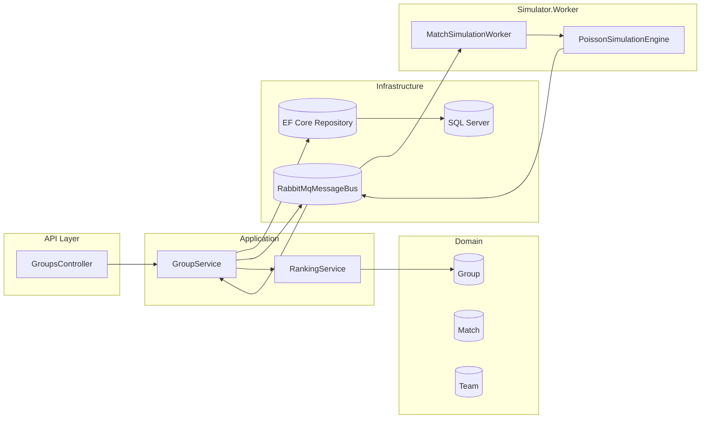

# Volledige Uitleg & Achtergrond – GroupStageSim

> Interne whitepaper / onboarding document voor ontwikkelaars. Doel: na het lezen kun je de volledige werking, ontwerpkeuzes, gebruikte technologieën en onderliggende theorie van GroupStageSim helder uitleggen alsof je het zelf gebouwd hebt.

---

## 1. Inleiding

**GroupStageSim** is een .NET 8 oplossing die een mini-toernooifase (groep van 4 teams) simuleert. Voor iedere groep worden wedstrijden (round-robin) gepland, Monte Carlo simulaties uitgevoerd om uitslagen te genereren, en vervolgens standen berekend met officiële tie-breaker regels (punten, doelsaldo, etc.). Het systeem bestaat uit een **API** (voor beheer en raadpleging), een **Worker** (voor verwerken van simulatieberichten) en een infrastructuurlaag voor persistente opslag en messaging.

### Hoofdrollen van de applicatie
1. Aanmaken van een groep met 4 teams.
2. Genereren van het volledig wedstrijdschema (6 wedstrijden: ieder team speelt 3 matches).
3. Publiceren van simulatiejobs naar RabbitMQ (event-driven).
4. Worker leest berichten, simuleert scores via een Poisson-verdeling.
5. Resultaten worden als events teruggeplaatst (MatchPlayed) en verwerkt in de database.
6. API exposeert actuele wedstrijden, simulatiestatus en ranglijsten.

### Gebruikte Technologieën
- **ASP.NET Core** (Web API + minimale Razor Pages redirect / controllers / middleware)
- **Entity Framework Core** (SQL Server persistence, code-first modeling, migrations)
- **RabbitMQ** (Message broker voor decoupling tussen API en simulatie worker)
- **Docker & Docker Compose** (Lokale containerisatie van SQL Server + RabbitMQ + services)
- **(Optioneel) Kubernetes** (Schaalbaarheid en productie-deployment scenario’s)
- **Serilog** (Structured logging)

### Doel van dit document
1. Begrijpen van de architectuur (lagen, afhankelijkheden, data- en eventstromen).
2. Begrijpen van C# / .NET concepten die gebruikt worden (records, async/await, dependency injection, LINQ, immutability).
3. Begrijpen van de achtergrondtheorie (Poisson-distributie, event-driven messaging, tie-breaker logica).
4. Handvatten bieden voor uitbreiding, debugging en tests.

---

## 2. Overzicht Architectuur

De oplossing past **Clean Architecture** en **SOLID** principes toe. Lagen zijn duidelijk gescheiden; hogere lagen kennen alleen interfaces naar lagere details (Dependency Inversion). Kernbusiness zit in Domain; orchestratie in Application; implementaties (EF Core, RabbitMQ) in Infrastructure; presentatie in API; simulatieverwerking in de Worker.

### Lagen en Projecten
- `Tournament.Domain`: Pure business entities (`Group`, `Team`, `Match`, `StandingRow`) en domeinservices (bv. `Scheduler`). Geen afhankelijkheid op externe frameworks.
- `Tournament.Application`: Use cases, orchestratie (`GroupService`, `RankingService`), abstractions (`IGroupRepository`, `IMessageBus`, `ISimulationEngine`). Kent Domain maar niet Infrastructure.
- `Tournament.Infrastructure`: Implementaties van abstractions (EF Core repositories, RabbitMQ message bus, health checks). Hangt af van Application & Domain.
- `Tournament.Api`: Presentatielaag (controllers zoals `GroupsController`), DI-compositie in `Program.cs`.
- `Simulator.Worker`: Background worker (`MatchSimulationWorker`) voor verwerken van `MatchScheduled` events naar `MatchPlayed` events.
- `Contracts`: Cross-service message contracts (records) voor losse koppeling.

### Waarom Clean Architecture / SOLID?
| Principe | Toepassing | Resultaat |
|----------|------------|-----------|
| SRP | `RankingService` alleen ranking; `Scheduler` alleen planning | Makkelijk testen / wijzigen |
| OCP | Nieuwe simulatie-engine via `ISimulationEngine` | Uitbreidbaar zonder bestaande code te breken |
| LSP | Elke `IMessageBus` implementatie vervangbaar | Schone substitutie (in-memory vs RabbitMQ) |
| ISP | Kleine interfaces: `IGroupRepository`, `ISimulationEngine` | Minder verplichtingen bij implementatie |
| DIP | Hogere lagen tegen abstractions | Loose coupling, testbaarheid |

### Datastroom (Mermaid Diagram)


### Concepten
- **Dependency Injection (DI)**: Registraties via `AddApplicationServices()` en `AddInfrastructure()`; instellingen via `IOptions<T>` voor RabbitMQ en Simulation.
- **Inversion of Control**: Framework (ASP.NET Core host) bouwt objectgraph; code vraagt dependencies via constructors.
- **Repository Pattern**: `IGroupRepository` abstraheert EF Core; Application hoeft database specifics niet te kennen.
- **Message Bus Abstraction**: `IMessageBus` decouples publicatie van events van concrete RabbitMQ code.

### Aanbevolen bronnen
- Common architecture: https://learn.microsoft.com/dotnet/architecture/modern-web-apps-azure/common-web-application-architectures
- SOLID: https://en.wikipedia.org/wiki/SOLID

---

## 3. ASP.NET Core Fundamentals

### Controllers & Endpoints
`GroupsController` exposeert endpoints zoals:
- `POST /groups` – Maak groep aan
- `POST /groups/{id}/simulate?iterations=100` – Start simulatie
- `GET /groups/{id}/standings` – Haal actuele ranglijst
- `GET /groups/{id}/matches` – Alle wedstrijden

Gebruik van `[ApiController]` zorgt voor automatische modelbinding, validatie en consistente responses.

### Model Binding & DTO’s
Requests (`CreateGroupRequest`) worden naar command objecten vertaald (`CreateGroupCommand`). Responses via mapping (`GroupApiMapper`). Domain entities blijven gescheiden van API-contracten.

### `Program.cs`
Registreert services, middleware en pipelines:
```csharp
builder.Services.AddApplicationServices();
builder.Services.AddInfrastructure(builder.Configuration);
builder.Services.AddControllers();
builder.Services.AddSwaggerGen();
builder.Services.AddHealthChecks()...;
```
Daarna runnen van migraties in ontwikkel-/Docker-omgeving en conditioneel Swagger inschakelen.

### Configuratie (`appsettings.json`/Environment)
`IConfiguration` combineert JSON + environment variables. ConnectionStrings, RabbitMq-instellingen en Simulation parameters worden via DI (`IOptions<T>`) aan services doorgegeven.

### Middleware
- **SerilogRequestLogging**: Logging van HTTP verzoeken
- **ExceptionHandler**: Centrale error-afhandeling
- **StatusCodePages**: Standaard responses voor error codes
- **Health Checks**: `/health/live`, `/health/ready` voor liveness/readiness

### Swagger
Automatische OpenAPI documentatie (Swashbuckle) voor ontdekbaarheid en testbaarheid.

### Bronnen
- Fundamentals: https://learn.microsoft.com/aspnet/core/fundamentals/
- Dependency Injection: https://learn.microsoft.com/aspnet/core/fundamentals/dependency-injection
- Getting Started: https://learn.microsoft.com/aspnet/core/tutorials/getting-started

---

## 4. C# Taalconcepten die worden gebruikt

### `record` vs `class`
Records (bv. `MatchScheduled`) zijn immutabel en ideaal voor DTO’s / messages. Classes voor rich domain gedrag (`Group`). Records ondersteunen value-based equality, handig voor testen.

### Async/Await & `CancellationToken`
Alle IO-bound bewerkingen (DB, messaging, simulatie) gebruiken `async` methods en ontvangen een `CancellationToken` voor cooperative cancel (graceful shutdown, API timeouts).

### LINQ in `RankingService`
Chaining van `OrderByDescending`, `ThenBy` voor tie-breakers en filtering van gespeelde wedstrijden:
```csharp
var ordered = standings
  .OrderByDescending(r => r.Points)
  .ThenByDescending(r => r.GoalDifference)
  .ThenByDescending(r => r.GoalsFor)
  .ThenBy(r => r.GoalsAgainst)
  .ToList();
```

### Collectietypen
Gebruik van `IReadOnlyCollection<T>` en `IEnumerable<T>` waar mogelijk verhoogt immutability & testbaarheid (makkelijk stubs leveren). Vermijdt onnodige mutatie.

### Nullability & Pattern Matching
Modern C# features zoals `if (strength is <= 0 or > 5)` voor duidelijke validatie. `?` annotaties helpen bij compile-time waarschuwingen voor potentieel null gebruik.

### Expression-bodied members
Kleinere utility methods worden compact (bv. `private static double ClampStrength(double r) => Math.Clamp(r, 0.5d, 1.5d);`). Verbetert leesbaarheid.

### Projectbestanden & Build
`.csproj` definieert target framework (`net8.0`). De build pipeline compileert per project, dependency graph resolved via NuGet. DI wiring vindt plaats in `Program.cs` of `DependencyInjection.cs` extension methods.

### Bronnen
- C#: https://learn.microsoft.com/dotnet/csharp/
- Async: https://learn.microsoft.com/dotnet/csharp/asynchronous-programming/
- LINQ: https://learn.microsoft.com/dotnet/standard/linq/

---

## 5. Entity Framework Core

### DbContext
`GroupStageSimDbContext` exposeert `DbSet<GroupData>`, `DbSet<TeamData>`, `DbSet<MatchData>`; mapping profielen (via `ApplyConfigurationsFromAssembly`) configureren schema.

### Code-First & Migrations
Model-definities genereren database schema. `Database.Migrate()` in startup (ontwikkel/Docker) zorgt dat schema bijwerkt naar laatste migratie.

### Connection Strings
In Docker via environment: `ConnectionStrings__Default=Server=sqlserver,...` door EF Core gebruikt.

### Plaatsing binnen Clean Architecture
Alle EF Core code zit in Infrastructure. Application ziet enkel `IGroupRepository` en domain entiteiten. Mapping van data model ↔ domain model centraliseert conversie.

### Bronnen
- EF Core intro: https://learn.microsoft.com/ef/core/
- Modeling: https://learn.microsoft.com/ef/core/modeling/
- Migrations: https://learn.microsoft.com/ef/core/migrations/

---

## 6. Contracts & Messaging (RabbitMQ)

### Waarom losstaand `Contracts` project?
Zorgt voor **schema governance**. Zowel API als Worker refereren alleen deze assembly voor message vorm; voorkomt ‘shared domain leakage’.

### Wat is een Message Contract?
Een immutable DTO (record) dat de payload definieert voor een message queue. Voorbeeld:
```csharp
public sealed record MatchScheduled(
    Guid MatchId,
    Guid GroupId,
    Guid HomeTeamId,
    Guid AwayTeamId,
    int Round,
    DateTimeOffset ScheduledKickoff,
    int Iteration,
    int Iterations,
    Guid CorrelationId,
    double StrengthHome,
    double StrengthAway);
```

### RabbitMQ Kernconcepten
- **Exchange**: Router van messages.
- **Queue**: Buffer waar consumers van lezen.
- **Routing Key**: String voor exchange ↔ queue binding beslissingen.
- **Topic Exchange**: Pattern matching op routing key (flexibeler dan direct).

### Flow
1. API / Service publiceert `match.scheduled` (routing key) naar exchange.
2. Worker queue is gebonden aan deze routing key.
3. Worker consumeert bericht, simuleert score, publiceert `match.played`.
4. API/service verwerkt resultaten en update persistente opslag.

### Idempotentie
Door unieke `MatchId` + `Iteration` combinaties te gebruiken wordt dubbel verwerken voorkomen (eventual consistency). Laatste iteratie leidt tot persistente update.

### Loose Coupling
Publishers kennen alleen `IMessageBus`; geen directe afhankelijkheid van RabbitMQ classes. Consumers verwerken JSON payload → contract type via `System.Text.Json`.

### Bronnen
- RabbitMQ Tutorials: https://www.rabbitmq.com/tutorials/
- Getting Started: https://www.rabbitmq.com/getstarted.html
- Microservice Communication: https://learn.microsoft.com/dotnet/architecture/microservices/microservice-communication
- Message broker: https://en.wikipedia.org/wiki/Message_broker

---

## 7. Simulator.Worker

### Worker Service Concept
Gebaseerd op `BackgroundService`. Draait continu, luistert naar queue, verwerkt berichten asynchroon. Registratie via `AddHostedService<MatchSimulationWorker>()`.

### Verwerkingsloop (vereenvoudigd)
```csharp
protected override Task ExecuteAsync(CancellationToken stoppingToken)
{
    channel.BasicConsume(queue: QueueName, autoAck: false, consumer: consumer);
    // consumer.Received => OnMessageAsync
}

private async Task OnMessageAsync(object sender, BasicDeliverEventArgs eventArgs)
{
    var scheduled = Deserialize(eventArgs.Body.Span);
    await ProcessMessageAsync(scheduled, eventArgs.DeliveryTag);
}
```

### Simulatie Engine (`ISimulationEngine`)
Interface maakt uitwisselen van implementaties mogelijk (Poisson, alternatieve modellen). `PoissonSimulationEngine` neemt team strengths en berekent lambda-waarden voor doelkansen.

### Poisson-distributie Theorie
De Poisson-verdeling modelleert aantal gebeurtenissen (doelpunten) binnen een vaste tijdsinterval bij een gemiddelde rate λ. Sportwedstrijden (met lage en discrete score-uitkomsten) passen goed bij Poisson-model aannames.
Formule: \( P(X=k) = \frac{e^{-\lambda} \lambda^k}{k!} \)

Knuth’s algoritme wordt gebruikt om een Poisson-sample te genereren:
1. Bereken `limit = exp(-lambda)`.
2. Multipliceer uniforme randoms tot product < limit.
3. Aantal iteraties - 1 = sample.

### Deterministische Seeds
```csharp
var hash = HashCode.Combine(options.DefaultSeed, match.Id, iteration);
var rng = new Random(hash & int.MaxValue);
```
Garandeert reproduceerbare simulaties (essentieel voor tests / debugging).

### Resultaatpublicatie
Na iedere iteratie publiceert Worker een `MatchPlayed` event. Laatste iteratie triggert persistente opslag van eindresultaat.

### Bronnen
- Worker Services: https://learn.microsoft.com/dotnet/core/extensions/workers
- Queue Services: https://learn.microsoft.com/dotnet/core/extensions/queue-service
- Poisson uitleg: https://towardsdatascience.com/understanding-the-poisson-distribution-6e50bb137b52

---

## 8. Ranking en Businesslogica

### Tie-breaker Regels
Gebruikelijke aflopende prioriteit:
1. Points
2. Goal Difference (GD)
3. Goals For (GF)
4. Goals Against (GA)
5. Head-to-Head onderling (mini-ladder)
6. Teamnaam als laatste deterministische fallback (stabiel sorteerresultaat)

### Head-to-Head Resolutie
Bij gelijke primary metrics: selecteer betrokken teams → filter wedstrijden waar beide teams deelnemen → herbereken aggregate stats → sorteer opnieuw met dezelfde regels.

### Waarom in Application-laag?
- De logica **orchestration + berekening** is domeinrelevant maar kan framework-onafhankelijk blijven.
- Testbaarheid: Geen EF of RabbitMQ afhankelijkheden.

### LINQ Gebruikt voor:
- Filteren van gespeelde matches
- Aggregatie naar `TeamAggregate`
- Ordering voor tie-breakers

### Bronnen
- UEFA/FIFA tiebreakers (algemene referentie): https://en.wikipedia.org/wiki/FIFA_World_Cup#Qualification (en subsecties over tie-breakers)
- LINQ: https://learn.microsoft.com/dotnet/csharp/programming-guide/concepts/linq/

---

## 9. Testing

### Testtypen
- **Unit tests**: individuele services (`RankingService`, `Scheduler`).
- **Integration tests**: Repository + EF + InMemory/Container SQL.
- **End-to-End**: Eventflow API → RabbitMQ → Worker → Database → API query.

### Determinisme voor Tests
Vaste seed: herhaalbare resultaten, laat assertions stabiel blijven.

### Testframeworks (aanbevolen)
- xUnit: gestandaardiseerd test framework.
- FluentAssertions: expressieve assertions.
- Testcontainers: spin ephemeral RabbitMQ + SQL voor realistische integratie.

### Bronnen
- .NET Testing: https://learn.microsoft.com/dotnet/core/testing/
- xUnit: https://xunit.net/
- FluentAssertions: https://fluentassertions.com/

---

## 10. Docker, RabbitMQ en Kubernetes

### Docker Compose
`docker-compose.yml` start SQL Server, RabbitMQ, API, Worker. Poorten:
- SQL: `7272:1433`
- RabbitMQ AMQP: `5672:5672`
- RabbitMQ Management: `15672:15672`
- API: `5180:8080`

### Netwerk & Resolving
Containers delen een netwerk; services bereiken elkaar via containernaam (`sqlserver`, `rabbitmq`). Connection strings verwijzen naar deze hostnames.

### Waarom Docker?
- Consistente lokale omgeving
- Reproduceerbare infrastructuur
- Makkelijk CI integratie

### Kubernetes (toekomst scenario’s)
- **Schaalbaarheid**: Replicas voor Worker.
- **Reliability**: Probes (liveness/readiness) equivalent aan health endpoints.
- **Configuratie**: ConfigMaps/Secrets voor RabbitMQ en DB instellingen.

### Bronnen
- Docker: https://docs.docker.com/get-started/overview/
- Kubernetes: https://kubernetes.io/docs/home/
- Containerisering .NET: https://learn.microsoft.com/dotnet/architecture/microservices/containerize-net-apps/docker-containers-for-microservices

---

## 11. Observability & Logging

### Logging
**Serilog** integreert structured logging (properties zoals `Application`, `CorrelationId`). In `Program.cs` configuratie via `UseSerilog`. Worker idem.

### Correlation Id
Elke simulatiestart genereert `CorrelationId` om gerelateerde events en logregels te groeperen (traceability, debugging).

### Health Checks
Routes:
- `/health/live` / `/healthz` – liveness (kijkt niet naar dependencies)
- `/health/ready` / `/healthz/ready` – readiness (DB, RabbitMQ checks)
Implementeert `AddDbContextCheck` en custom RabbitMQ health check.

### Aanbevolen Uitbreidingen
- Distributed tracing (OpenTelemetry) voor volledige eventflow.
- Metrics export (Prometheus) voor simulatie snelheid / wachtrij lengte.

### Bronnen
- Health Checks: https://learn.microsoft.com/aspnet/core/diagnostics/health-checks
- Serilog: https://serilog.net/

---

## 12. Samenvatting & Presentatiehints

### Hoe Alles Samenwerkt (High-Level Pitch)
1. API creëert groep → plant 6 matches → publiceert simulatie events.
2. RabbitMQ levert events aan Worker die scores met Poisson simuleert.
3. Worker publiceert `MatchPlayed` events; laatste iteratie persistente opslag.
4. API leest DB en berekent standings met gedetailleerde tie-breakers.
5. Logging + health checks + deterministische simulatie maken beheer en testen robuust.

### Sterke Ontwerpkeuzes
- Clean Architecture + SOLID → scheid concerns, hoge testbaarheid.
- Event-driven via RabbitMQ → asynchrone schaalbare verwerking.
- Deterministische Poisson simulatie → herhaalbaarheid.
- Heldere ranking logica → reproduceerbare en uitlegbare uitkomsten.
- Docker-compose → eenvoudige lokale spin-up.
- Abstractions voor repositories/messaging → vervangbaarheid.

### Interview / Verdediging Tips
- Benadruk waarom Poisson logisch is voor lage score sporten.
- Leg uit hoe correlation IDs helpen bij traceability.
- Toon dat domain layer framework-vrij is (future-proof).
- Beschrijf waarom Head-to-Head resolutie apart wordt uitgevoerd (fair tiebreaker).
- Verduidelijk dat Worker retry/backoff gebruikt voor robustness.

### Mogelijke Verbeteringen
- Toevoegen van OpenTelemetry tracing.
- Meer granular retries / DLQ (Dead Letter Queue) voor onherstelbare berichten.
- Additionele simulatiemodellen (Elo / Bayesian updates per team).
- API rate limiting / caching van standings.
- Event sourcing voor auditeerbare matchresultaat evolutie.

---

## Bronnen Overzicht (Alle Referenties)
1. Common Web App Architectures – https://learn.microsoft.com/dotnet/architecture/modern-web-apps-azure/common-web-application-architectures
2. SOLID – https://en.wikipedia.org/wiki/SOLID
3. ASP.NET Core Fundamentals – https://learn.microsoft.com/aspnet/core/fundamentals/
4. ASP.NET Core DI – https://learn.microsoft.com/aspnet/core/fundamentals/dependency-injection
5. ASP.NET Getting Started – https://learn.microsoft.com/aspnet/core/tutorials/getting-started
6. C# Language – https://learn.microsoft.com/dotnet/csharp/
7. Async Programming – https://learn.microsoft.com/dotnet/csharp/asynchronous-programming/
8. LINQ Guide – https://learn.microsoft.com/dotnet/standard/linq/
9. EF Core – https://learn.microsoft.com/ef/core/
10. EF Core Modeling – https://learn.microsoft.com/ef/core/modeling/
11. EF Core Migrations – https://learn.microsoft.com/ef/core/migrations/
12. RabbitMQ Tutorials – https://www.rabbitmq.com/tutorials/
13. RabbitMQ Getting Started – https://www.rabbitmq.com/getstarted.html
14. Microservice Communication – https://learn.microsoft.com/dotnet/architecture/microservices/microservice-communication
15. Message Broker – https://en.wikipedia.org/wiki/Message_broker
16. Worker Services – https://learn.microsoft.com/dotnet/core/extensions/workers
17. Queue Service Patterns – https://learn.microsoft.com/dotnet/core/extensions/queue-service
18. Poisson Explainer – https://towardsdatascience.com/understanding-the-poisson-distribution-6e50bb137b52
19. FIFA/UEFA Tiebreakers – https://en.wikipedia.org/wiki/FIFA_World_Cup#Qualification (afgeleide referentie)
20. .NET Testing – https://learn.microsoft.com/dotnet/core/testing/
21. xUnit – https://xunit.net/
22. FluentAssertions – https://fluentassertions.com/
23. Docker Overview – https://docs.docker.com/get-started/overview/
24. Kubernetes Docs – https://kubernetes.io/docs/home/
25. Containerize .NET – https://learn.microsoft.com/dotnet/architecture/microservices/containerize-net-apps/docker-containers-for-microservices
26. Health Checks – https://learn.microsoft.com/aspnet/core/diagnostics/health-checks
27. Serilog – https://serilog.net/

---

## Top 10 Kernpunten om Project Zelfverzekerd uit te Leggen
1. Het systeem volgt Clean Architecture: Domain (pure), Application (use cases), Infrastructure (implementaties), API (presentatie), Worker (async verwerking), Contracts (schema’s).
2. Event-driven ontwerp via RabbitMQ zorgt voor asynchrone losgekoppelde simulatieverwerking (publish/consume patroon).
3. Simulaties gebruiken een Poisson-distributie met deterministische seeds voor herhaalbare resultaten.
4. RankingService implementeert formele tie-breaker regels met Head-to-Head mini-tabel voor eerlijke differentiatie.
5. Dependency Injection centraliseert wiring (extension methods) en verhoogt testbaarheid en vervangbaarheid.
6. EF Core wordt uitsluitend in Infrastructure gebruikt; Application werkt tegen abstractions (`IGroupRepository`).
7. Records voor message contracts bieden immutability en value equality; classes voor rich domain behavior.
8. Health checks en structured logging (Serilog) verbeteren observable reliability en productierijpheid.
9. Docker Compose geeft een volledige lokale stack (SQL + RabbitMQ + services) zonder externe setup.
10. Het ontwerp is uitbreidbaar: nieuwe simulatiemodellen via `ISimulationEngine`, nieuwe message bus implementaties via `IMessageBus`.

---

Einde document.
